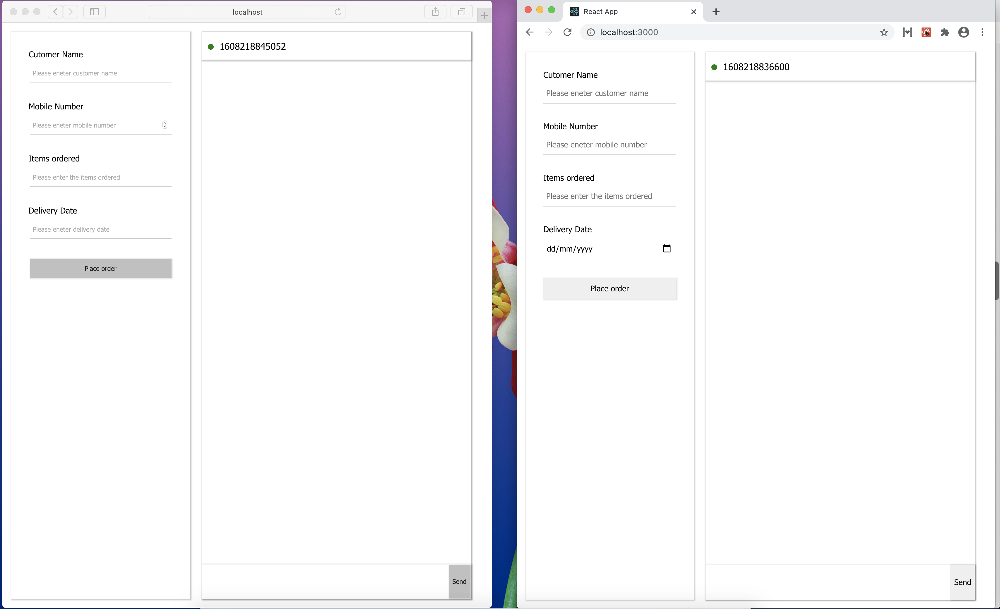
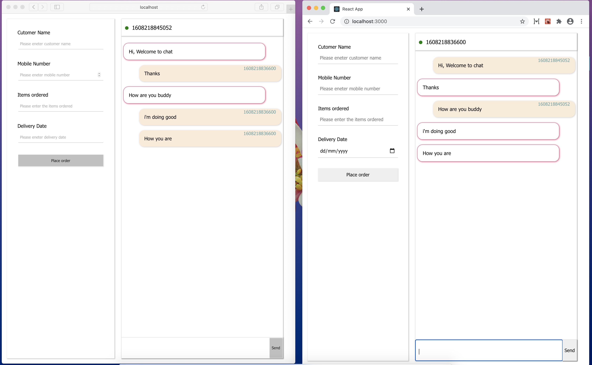
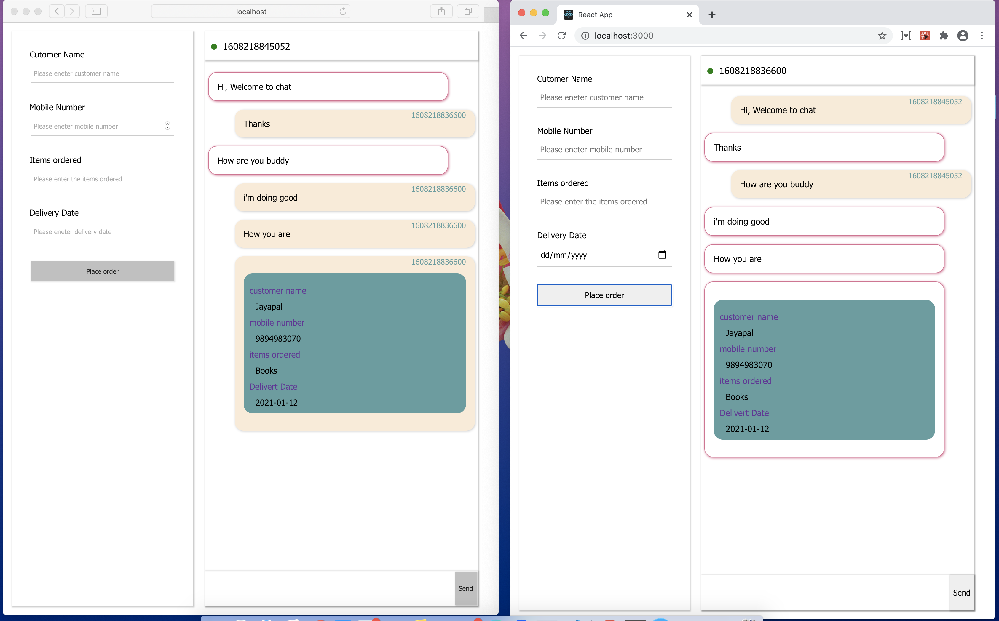

# Chat Application 

This is basic Chat application to support sending message and order placed from Shopping cart page.

## Tech Stack

    - React
    - Apollo Graphql

## Run application

Download this code from [Github](https://github.com/itzfyp/basic-chat.git)

### Server

open to root of server folder

    cd api

install dependeices

    npm i

run api server

    npm start

### Application

open root of the application folder

    cd api

install dependencies

    npm i

run application

    npm start

open application on multiple browser to chat as multple user 

    http://localhost:3000/

### Application Screenshots

With two window chat

With Chat

With Placed Cart

